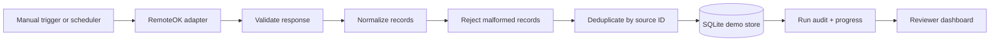
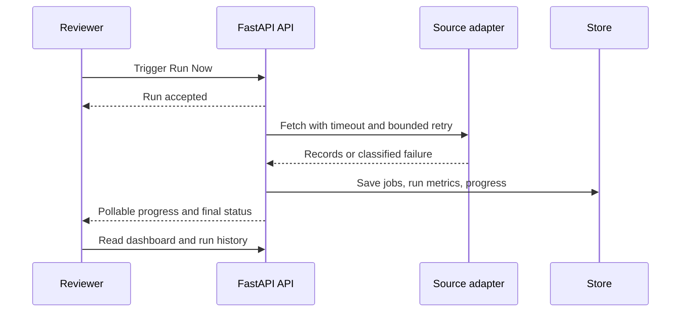

# DECISIONS.md

## 1. Why this ingestion strategy?

I chose one permitted public source, RemoteOK’s public JSON feed, instead of the obvious alternative of building several connectors or scraping authenticated job sites. One real source lets the full path be implemented and explained properly: request pacing, timeout handling, bounded retry, schema validation, normalization, source-ID deduplication, persistence, audit metrics, and reviewer-visible progress. The alternative would have created broader surface area but weaker evidence and more compliance risk.

The system stops when a source returns a block, CAPTCHA-like response, access denial, or repeated failure. It does not bypass controls, automate accounts, rotate proxies to evade blocking, or solve CAPTCHAs. A controlled in-process sandbox source is used for deterministic failure tests, so the real provider is never stressed by test scenarios.

## 2. One time-limit trade-off

The main trade-off was using SQLite for the Python release instead of completing a managed production database integration. SQLite makes the laptop setup and short demonstration simple, but it is not the right durability model for a multi-instance deployed service. With a real week, I would connect managed PostgreSQL or MySQL, add migrations and backup policy, move ingestion to a durable worker queue, and run acceptance tests against the deployed service rather than relying mainly on local verification.

The visible table intentionally shows the first 20 records for readability. The run metrics still represent the full fetch, so the presentation is smaller without changing the data result.

## 3. AI use and personal verification

AI assisted with scaffolding, code organization, UI drafts, documentation, and test ideas. I personally checked the source boundary, parser behavior, retry and stop rules, deduplication contract, database fields, protected trigger behavior, progress completion, selected-run behavior, and the visible dashboard against the running project. The test suite covers parsing, deduplication, retry behavior, protected triggering, controlled failures, metric separation, and selected-run retrieval.

The final claims are intentionally limited. Local TypeScript, Vitest, Python, syntax, and preview checks passed. The Python deployment, external scheduler, and managed production database still require independent verification after publication. Internal run IDs remain in the backend for correlation, but they are not presented as user-facing content.
